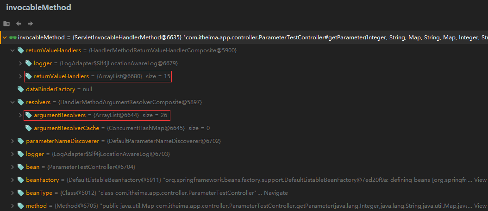

org.springframework.web.servlet.DispatcherServlet的doDispatch()方法的

    protected void doDispatch(HttpServletRequest request, HttpServletResponse response) throws Exception {
    HttpServletRequest processedRequest = request;
    HandlerExecutionChain mappedHandler = null;
    boolean multipartRequestParsed = false;
    WebAsyncManager asyncManager = WebAsyncUtils.getAsyncManager(request);

        try {
            try {
                ModelAndView mv = null;
                Object dispatchException = null;

                try {
                    processedRequest = this.checkMultipart(request);
                    multipartRequestParsed = processedRequest != request;
                    //获取那个类处理那个请求的映射信息
                    mappedHandler = this.getHandler(processedRequest);
                    if (mappedHandler == null) {
                        this.noHandlerFound(processedRequest, response);
                        return;
                    }
                    //获取到一个具体的handler可以理解为一个反射工具 
                    HandlerAdapter ha = this.getHandlerAdapter(mappedHandler.getHandler());
                    String method = request.getMethod();
                    boolean isGet = "GET".equals(method);
                    if (isGet || "HEAD".equals(method)) {
                        long lastModified = ha.getLastModified(request, mappedHandler.getHandler());
                        if ((new ServletWebRequest(request, response)).checkNotModified(lastModified) && isGet) {
                            return;
                        }
                    }

                    if (!mappedHandler.applyPreHandle(processedRequest, response)) {
                        return;
                    }
                    //真正执行目标方法
                    mv = ha.handle(processedRequest, response, mappedHandler.getHandler());
                    if (asyncManager.isConcurrentHandlingStarted()) {
                        return;
                    }

                    this.applyDefaultViewName(processedRequest, mv);
                    mappedHandler.applyPostHandle(processedRequest, response, mv);
                } catch (Exception var20) {
                    dispatchException = var20;
                } catch (Throwable var21) {
                    dispatchException = new NestedServletException("Handler dispatch failed", var21);
                }

                this.processDispatchResult(processedRequest, response, mappedHandler, mv, (Exception)dispatchException);
            } catch (Exception var22) {
                this.triggerAfterCompletion(processedRequest, response, mappedHandler, var22);
            } catch (Throwable var23) {
                this.triggerAfterCompletion(processedRequest, response, mappedHandler, new NestedServletException("Handler processing failed", var23));
            }


HandlerAdapter ha = this.getHandlerAdapter(mappedHandler.getHandler());主要用于获取到一个用于2执行方法的反射工具其中完成了参数的解析
参数处理原理
● HandlerMapping中找到能处理请求的Handler（Controller.method()）
● 为当前Handler 找一个适配器 HandlerAdapter； RequestMappingHandlerAdapter
● 适配器执行目标方法并确定方法参数的每一个值
1.HandlerAdapter四种 
   1.1 RequestMappingHandlerAdapter 处理@RequestMapping注解的方法
   1.2 HandlerFunctionAdapter   处理函数式编程
   1.3 HttpRequestHandlerAdapter
   1.4 SimpleControllerHandlerAdapter

mv = ha.handle(processedRequest, response, mappedHandler.getHandler()); 真正来到RequestMappingHandlerAdapter

来到org.springframework.web.servlet.mvc.method.annotation.RequestMappingHandlerAdapter的 handleInternal中

mav = this.invokeHandlerMethod(request, response, handlerMethod);正真指行目标方法

     @Nullable
    protected ModelAndView invokeHandlerMethod(HttpServletRequest request, HttpServletResponse response, HandlerMethod handlerMethod) throws Exception {
        ServletWebRequest webRequest = new ServletWebRequest(request, response);

        ModelAndView var15;
        try {
            WebDataBinderFactory binderFactory = this.getDataBinderFactory(handlerMethod);
            ModelFactory modelFactory = this.getModelFactory(handlerMethod, binderFactory);
            //invocableMethod 翻译为可执行的方法 对原来的方法进行一次封装
            ServletInvocableHandlerMethod invocableMethod = this.createInvocableHandlerMethod(handlerMethod);
            //设置参数解析器 26个参数解析器 
            if (this.argumentResolvers != null) {
                invocableMethod.setHandlerMethodArgumentResolvers(this.argumentResolvers);
            }
            //15个支持的返回值类型的处理器
            if (this.returnValueHandlers != null) {
                invocableMethod.setHandlerMethodReturnValueHandlers(this.returnValueHandlers);
            }
            //执行完成上面的程序invocableMethod放入26个参数解析器和15个支持的返回值类型的处理器
            invocableMethod.setDataBinderFactory(binderFactory);
            invocableMethod.setParameterNameDiscoverer(this.parameterNameDiscoverer);
            ModelAndViewContainer mavContainer = new ModelAndViewContainer();
            mavContainer.addAllAttributes(RequestContextUtils.getInputFlashMap(request));
            modelFactory.initModel(webRequest, mavContainer, invocableMethod);
            mavContainer.setIgnoreDefaultModelOnRedirect(this.ignoreDefaultModelOnRedirect);
            AsyncWebRequest asyncWebRequest = WebAsyncUtils.createAsyncWebRequest(request, response);
            asyncWebRequest.setTimeout(this.asyncRequestTimeout);
            WebAsyncManager asyncManager = WebAsyncUtils.getAsyncManager(request);
            asyncManager.setTaskExecutor(this.taskExecutor);
            asyncManager.setAsyncWebRequest(asyncWebRequest);
            asyncManager.registerCallableInterceptors(this.callableInterceptors);
            asyncManager.registerDeferredResultInterceptors(this.deferredResultInterceptors);
            Object result;
            if (asyncManager.hasConcurrentResult()) {
                result = asyncManager.getConcurrentResult();
                mavContainer = (ModelAndViewContainer)asyncManager.getConcurrentResultContext()[0];
                asyncManager.clearConcurrentResult();
                LogFormatUtils.traceDebug(this.logger, (traceOn) -> {
                    String formatted = LogFormatUtils.formatValue(result, !traceOn);
                    return "Resume with async result [" + formatted + "]";
                });
                invocableMethod = invocableMethod.wrapConcurrentResult(result);
            }
            //核心，执行目标方法
            invocableMethod.invokeAndHandle(webRequest, mavContainer, new Object[0]);
            if (asyncManager.isConcurrentHandlingStarted()) {
                result = null;
                return (ModelAndView)result;
            }

            var15 = this.getModelAndView(mavContainer, modelFactory, webRequest);
        } finally {
            webRequest.requestCompleted();
        }

        return var15;
    }



26个参数解析器：
0 = {RequestParamMethodArgumentResolver@6647}  支持标注@RequestParam注解的参数
1 = {RequestParamMapMethodArgumentResolver@6648}
2 = {PathVariableMethodArgumentResolver@6649}   支持标注@PathVariable注解的参数
3 = {PathVariableMapMethodArgumentResolver@6650}
4 = {MatrixVariableMethodArgumentResolver@6651}
5 = {MatrixVariableMapMethodArgumentResolver@6652}
6 = {ServletModelAttributeMethodProcessor@6653}
7 = {RequestResponseBodyMethodProcessor@6654}
8 = {RequestPartMethodArgumentResolver@6655}
9 = {RequestHeaderMethodArgumentResolver@6656}
10 = {RequestHeaderMapMethodArgumentResolver@6657}
11 = {ServletCookieValueMethodArgumentResolver@6658}
12 = {ExpressionValueMethodArgumentResolver@6659}
13 = {SessionAttributeMethodArgumentResolver@6660}
14 = {RequestAttributeMethodArgumentResolver@6661}
15 = {ServletRequestMethodArgumentResolver@6662}  支持原生的servletAPI 比如HttpSession HttpServletRequest HttpServletResponse
16 = {ServletResponseMethodArgumentResolver@6663}
17 = {HttpEntityMethodProcessor@6664}
18 = {RedirectAttributesMethodArgumentResolver@6665}
19 = {ModelMethodProcessor@6666}
20 = {MapMethodProcessor@6667}
21 = {ErrorsMethodArgumentResolver@6668}
22 = {SessionStatusMethodArgumentResolver@6669}
23 = {UriComponentsBuilderMethodArgumentResolver@6670}
24 = {RequestParamMethodArgumentResolver@6671}
25 = {ServletModelAttributeMethodProcessor@6672} 

```java
//参数解析器接口
 public interface HandlerMethodArgumentResolver {
       boolean supportsParameter(MethodParameter parameter);
       @Nullable
       Object resolveArgument(MethodParameter parameter, @Nullable ModelAndViewContainer mavContainer,
               NativeWebRequest webRequest, @Nullable WebDataBinderFactory binderFactory) throws Exception;
   
   }
```
  参数解析会分为两步,1.判断参数是否是支持的类型 2.如果是支持的类型就调用resolveArgument做参数解析

15个支持的返回值处理器
0 = {ModelAndViewMethodReturnValueHandler@6682}
1 = {ModelMethodProcessor@6683}
2 = {ViewMethodReturnValueHandler@6684}
3 = {ResponseBodyEmitterReturnValueHandler@6685}
4 = {StreamingResponseBodyReturnValueHandler@6686}
5 = {HttpEntityMethodProcessor@6687}
6 = {HttpHeadersReturnValueHandler@6688}
7 = {CallableMethodReturnValueHandler@6689}
8 = {DeferredResultMethodReturnValueHandler@6690}
9 = {AsyncTaskMethodReturnValueHandler@6691}
10 = {ModelAttributeMethodProcessor@6692}
11 = {RequestResponseBodyMethodProcessor@6693}
12 = {ViewNameMethodReturnValueHandler@6694}
13 = {MapMethodProcessor@6695}
14 = {ModelAttributeMethodProcessor@6696} 

进入核心方法：
invocableMethod.invokeAndHandle(webRequest, mavContainer, new Object[0]);
org.springframework.web.servlet.mvc.method.annotation.ServletInvocableHandlerMethod下

    public void invokeAndHandle(ServletWebRequest webRequest, ModelAndViewContainer mavContainer, Object... providedArgs) throws Exception {
        //核心，真正执行目标方法，并有一个返回值
        Object returnValue = this.invokeForRequest(webRequest, mavContainer, providedArgs);
        this.setResponseStatus(webRequest);
        if (returnValue == null) {
            if (this.isRequestNotModified(webRequest) || this.getResponseStatus() != null || mavContainer.isRequestHandled()) {
                this.disableContentCachingIfNecessary(webRequest);
                mavContainer.setRequestHandled(true);
                return;
            }
        } else if (StringUtils.hasText(this.getResponseStatusReason())) {
            mavContainer.setRequestHandled(true);
            return;
        }

        mavContainer.setRequestHandled(false);
        Assert.state(this.returnValueHandlers != null, "No return value handlers");

        try {
            //处理返回值
            this.returnValueHandlers.handleReturnValue(returnValue, this.getReturnValueType(returnValue), mavContainer, webRequest);
        } catch (Exception var6) {
            if (this.logger.isTraceEnabled()) {
                this.logger.trace(this.formatErrorForReturnValue(returnValue), var6);
            }

            throw var6;
        }
    }

真正执行目标方法 确定每一个参数的值 来到org.springframework.web.method.support.InvocableHandlerMethod
    
    @Nullable
	public Object invokeForRequest(NativeWebRequest request, @Nullable ModelAndViewContainer mavContainer,
			Object... providedArgs) throws Exception {
        //1.确定方法参数的值
		Object[] args = getMethodArgumentValues(request, mavContainer, providedArgs);
		if (logger.isTraceEnabled()) {
			logger.trace("Arguments: " + Arrays.toString(args));
		}
        //利用反射执行目标方法
		return doInvoke(args);
	}

进入 getMethodArgumentValues(request, mavContainer, providedArgs);


     protected Object[] getMethodArgumentValues(NativeWebRequest request, @Nullable ModelAndViewContainer mavContainer,
			Object... providedArgs) throws Exception {
        //1.获取每一个参数的详细声明 包含参数上标注的注解，参数的索引值，参数的类型等信息
		MethodParameter[] parameters = getMethodParameters();
        //方法你没有参数直接返回
		if (ObjectUtils.isEmpty(parameters)) {
			return EMPTY_ARGS;
		}
        //参数有多少个数据就有多长
		Object[] args = new Object[parameters.length];
        //2.遍历参数
		for (int i = 0; i < parameters.length; i++) {
			MethodParameter parameter = parameters[i];
            //2.1确定参数的名字
			parameter.initParameterNameDiscovery(this.parameterNameDiscoverer);
           
			args[i] = findProvidedArgument(parameter, providedArgs);
			if (args[i] != null) {
				continue;
			}
            //2.2判断当前解析器是否支持这种类型
			if (!this.resolvers.supportsParameter(parameter)) {
				throw new IllegalStateException(formatArgumentError(parameter, "No suitable resolver"));
			}
            //2.3真正的解析参数的值
			try {
				args[i] = this.resolvers.resolveArgument(parameter, mavContainer, request, this.dataBinderFactory);
			}
			catch (Exception ex) {
				// Leave stack trace for later, exception may actually be resolved and handled...
				if (logger.isDebugEnabled()) {
					String exMsg = ex.getMessage();
					if (exMsg != null && !exMsg.contains(parameter.getExecutable().toGenericString())) {
						logger.debug(formatArgumentError(parameter, exMsg));
					}
				}
				throw ex;
			}
		}
		return args;
	}

上面 2.2 步详解  遍历所有的参数解析器看那个解析器能够处理这个参数 将整个参数的信息全部传入 底层通过标注的注解判断 
               如果这个参数解析器支持该参数类型就会调用参数解析器的resolveArgument方法处理 上面在看参数解析接口有说明
    
    @Nullable
    //遍历所有的参数解析器看那个解析器能够处理这个参数 将整个参数的信息全部传入 底层通过标注的注解判断
	private HandlerMethodArgumentResolver getArgumentResolver(MethodParameter parameter) {
		HandlerMethodArgumentResolver result = this.argumentResolverCache.get(parameter);
		if (result == null) {
			for (HandlerMethodArgumentResolver resolver : this.argumentResolvers) {
				if (resolver.supportsParameter(parameter)) {
					result = resolver;
					this.argumentResolverCache.put(parameter, result);
					break;
				}
			}
		}
		return result;
	}


解析参数的值 来到 org.springframework.web.method.support.HandlerMethodArgumentResolverComposite中
    
    @Override
	@Nullable
	public Object resolveArgument(MethodParameter parameter, @Nullable ModelAndViewContainer mavContainer,
			NativeWebRequest webRequest, @Nullable WebDataBinderFactory binderFactory) throws Exception {

		HandlerMethodArgumentResolver resolver = getArgumentResolver(parameter);
		if (resolver == null) {
			throw new IllegalArgumentException("Unsupported parameter type [" +
					parameter.getParameterType().getName() + "]. supportsParameter should be called first.");
		}
        //解析过程
		return resolver.resolveArgument(parameter, mavContainer, webRequest, binderFactory);
	}

2.原生的servletAPI由ServletRequestMethodArgumentResolver支持解析
org.springframework.web.servlet.mvc.method.annotation.ServletRequestMethodArgumentResolver
      
       //参数类型为以下几种的都支持
       public boolean supportsParameter(MethodParameter parameter) {
            Class<?> paramType = parameter.getParameterType();
            return WebRequest.class.isAssignableFrom(paramType) || ServletRequest.class.isAssignableFrom(paramType) || 
            MultipartRequest.class.isAssignableFrom(paramType) || HttpSession.class.isAssignableFrom(paramType) || 
            pushBuilder != null && pushBuilder.isAssignableFrom(paramType) || Principal.class.isAssignableFrom(paramType) || 
            InputStream.class.isAssignableFrom(paramType) || Reader.class.isAssignableFrom(paramType) || 
            HttpMethod.class == paramType || Locale.class == paramType || TimeZone.class == paramType || 
            ZoneId.class == paramType;
    }

3、复杂参数：
Map、Model（map、model里面的数据会被放在request的请求域  request.setAttribute）、Errors/BindingResult、RedirectAttributes（ 重定向携带数据）、
ServletResponse（response）、SessionStatus、UriComponentsBuilder、ServletUriComponentsBuilder
    
复杂参数测试：

    @GetMapping( "/param/test")
    public String complexParam(Map<String,Object> param1, Model param2, HttpServletRequest request, HttpServletResponse response){
        param1.put("hello","world");
        param2.addAttribute("spring","springboot 2");
        request.setAttribute("world","hello");
        Cookie cookie = new Cookie("c","v");

        response.addCookie(cookie);
        return "forward:/page";
    }

    @ResponseBody
    @GetMapping("/page")
    public Map<String,Object> gotoPage(HttpServletRequest request){
        Object hello = request.getAttribute("hello");
        Object spring = request.getAttribute("spring");
        Object world = request.getAttribute("world");
        Map<String,Object> map = new HashMap<>();
        map.put("hello",hello);
        map.put("spring",spring);
        map.put("world",world);
        return map;
    }

断点调试：
  
目标方法执行完成  处理返回结果
org.springframework.web.servlet.mvc.method.annotation.ServletInvocableHandlerMethod下

      this.returnValueHandlers.handleReturnValue(returnValue, this.getReturnValueType(returnValue), mavContainer, webRequest);

来到org.springframework.web.method.support.HandlerMethodReturnValueHandlerComposite中     
      
        @Override
        public void handleReturnValue(@Nullable Object returnValue, MethodParameter returnType,
                ModelAndViewContainer mavContainer, NativeWebRequest webRequest) throws Exception {
            //得到处理结果的处理器
            HandlerMethodReturnValueHandler handler = selectHandler(returnValue, returnType);
            if (handler == null) {
                throw new IllegalArgumentException("Unknown return value type: " + returnType.getParameterType().getName());
            }
            //利用这个处理器处理返回结果
            handler.handleReturnValue(returnValue, returnType, mavContainer, webRequest);
        }

进入handleReturnValue(returnValue, returnType, mavContainer, webRequest);
org.springframework.web.servlet.mvc.method.annotation.ViewNameMethodReturnValueHandler下：

       public void handleReturnValue(@Nullable Object returnValue, MethodParameter returnType, ModelAndViewContainer mavContainer, NativeWebRequest webRequest) throws Exception {
        //判断返回值是否是一个字符串
        if (returnValue instanceof CharSequence) {
            String viewName = returnValue.toString();
            mavContainer.setViewName(viewName);
            if (this.isRedirectViewName(viewName)) {
                mavContainer.setRedirectModelScenario(true);
            }
        } else if (returnValue != null) {
            throw new UnsupportedOperationException("Unexpected return type: " + returnType.getParameterType().getName() + " in method: " + returnType.getMethod());
        }

    }